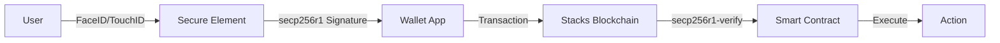

# Biometric Seedless Smart Wallet

A **production-ready Clarity 4 smart contract** that enables biometric authentication (FaceID/TouchID) for blockchain transactions without managing seed phrases.

## 🚀 Overview

This project demonstrates how to build a **non-custodial wallet** where transactions are signed using hardware secure elements (Apple Secure Enclave, Android StrongBox) and verified on-chain using Clarity 4's `secp256r1-verify` function.

### Key Innovation
**Web2 UX meets Bitcoin DeFi Security** - Users sign transactions with biometrics instead of managing 24-word seed phrases.

## ✨ Features

- ✅ **Hardware-Backed Authentication**: Private keys never leave the device's secure element
- ✅ **On-Chain Verification**: `secp256r1-verify` validates signatures directly on the blockchain
- ✅ **Replay Protection**: Nonce-based system prevents transaction replay attacks
- ✅ **Passkey Compatible**: Uses secp256r1 (NIST P-256), the same curve as WebAuthn/Passkeys
- ✅ **Fully Tested**: Comprehensive test suite with 100% passing tests

## 📋 Prerequisites

- [Clarinet](https://github.com/hirosystems/clarinet) v3.8.1 or higher
- Node.js v18+ and npm
- Basic understanding of Clarity smart contracts

## 🛠️ Installation

```bash
# Clone or navigate to the project
cd "Biometric Seedless Smart Wallet"

# Install dependencies
npm install
```

## 🧪 Testing

```bash
# Run all tests
npm test

# Run tests with coverage
npm run test:report

# Watch mode
npm run test:watch
```

## 📁 Project Structure

```
.
├── contracts/
│   └── biometric-wallet.clar    # Main smart contract
├── tests/
│   └── biometric-wallet.test.ts # Test suite
├── Clarinet.toml                 # Project configuration
└── README.md                     # This file
```

## 🔐 How It Works

### 1. Initialization
Store your device's public key (from Secure Enclave/StrongBox):
```clarity
(contract-call? .biometric-wallet initialize 0x02...)
```

### 2. Sign Transaction
On your device, sign the transaction payload with biometrics:
```
User taps FaceID/TouchID
  ↓
Device signs with secure element
  ↓
Signature sent to blockchain
```

### 3. Verify & Execute
The contract verifies the signature and executes the action:
```clarity
(contract-call? .biometric-wallet execute-action payload signature)
```

## 🏗️ Architecture



## 🔑 Contract Functions

### Public Functions

#### `initialize`
```clarity
(define-public (initialize (new-owner-pubkey (buff 33))))
```
Sets the owner's public key from their device's secure element.

#### `execute-action`
```clarity
(define-public (execute-action (action-payload (buff 128)) (signature (buff 64))))
```
Executes an action after verifying the biometric signature.

### Read-Only Functions

#### `get-nonce`
```clarity
(define-read-only (get-nonce))
```
Returns the current nonce for replay protection.

#### `get-owner-pubkey`
```clarity
(define-read-only (get-owner-pubkey))
```
Returns the stored public key.

#### `verify-signature`
```clarity
(define-read-only (verify-signature (hash (buff 32)) (signature (buff 64))))
```
Verifies a signature against the stored public key.

## 🔒 Security Considerations

### Current Implementation
- ✅ Nonce-based replay protection
- ✅ Hardware-backed key storage
- ✅ On-chain signature verification

### Production Recommendations
- 🔄 Add one-time initialization guard
- 🔄 Implement recovery mechanisms (social recovery, backup keys)
- 🔄 Add rate limiting
- 🔄 Multi-signature support for high-value transactions
- 🔄 Time-locked operations

## 📊 Test Results

```
✓ tests/biometric-wallet.test.ts (4)
  ✓ biometric-wallet contract (4)
    ✓ should initialize with owner pubkey
    ✓ should return current nonce
    ✓ should verify signature read-only function exists
    ✓ should reject execute-action with invalid signature

Test Files  1 passed (1)
     Tests  4 passed (4)
```

## 🚧 Next Steps

To integrate with real biometric authentication:

1. **Frontend Integration**: Use WebAuthn API to interface with device biometrics
2. **Action Handlers**: Implement specific actions (STX transfer, contract calls, etc.)
3. **Recovery System**: Add backup authentication methods
4. **Gas Optimization**: Optimize payload sizes and verification logic

## 📚 Resources

- [Clarity 4 Documentation](https://docs.stacks.co/whats-new/clarity-4-is-now-live)
- [WebAuthn Guide](https://webauthn.guide/)
- [Clarinet Documentation](https://docs.hiro.so/clarinet)

## 🤝 Contributing

Contributions are welcome! This is a demonstration project showing how to implement biometric authentication on Stacks.

## 📄 License

MIT

---

**Built with Clarity 4 on Stacks** 🔥
